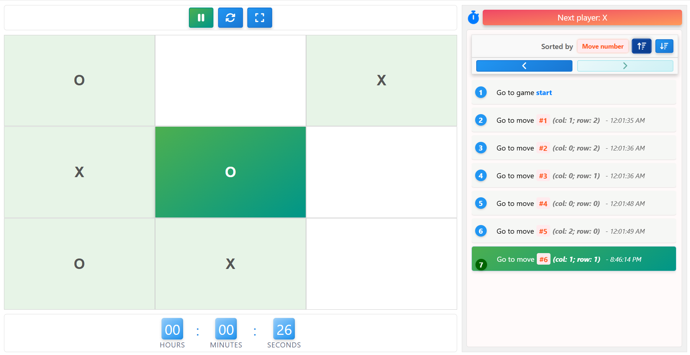
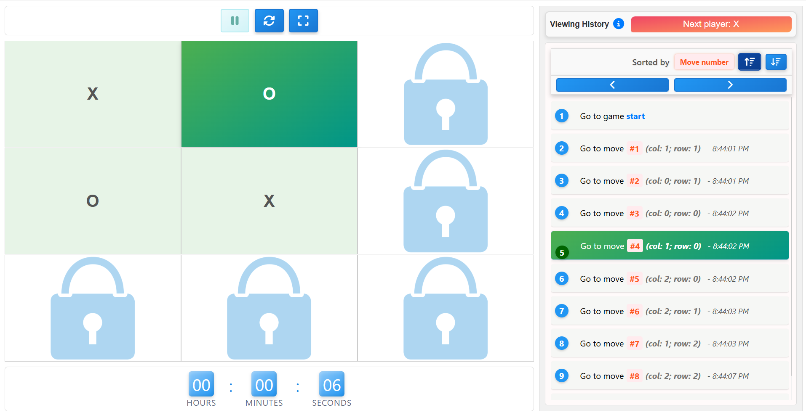
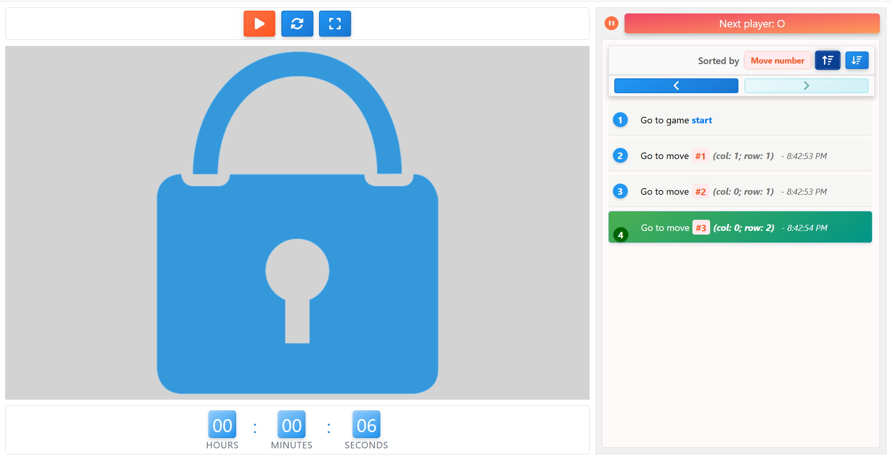
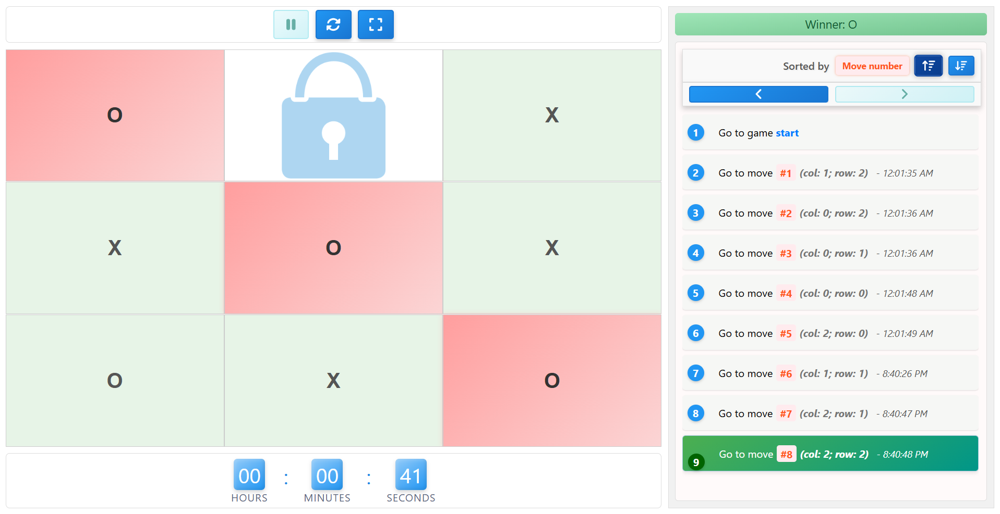
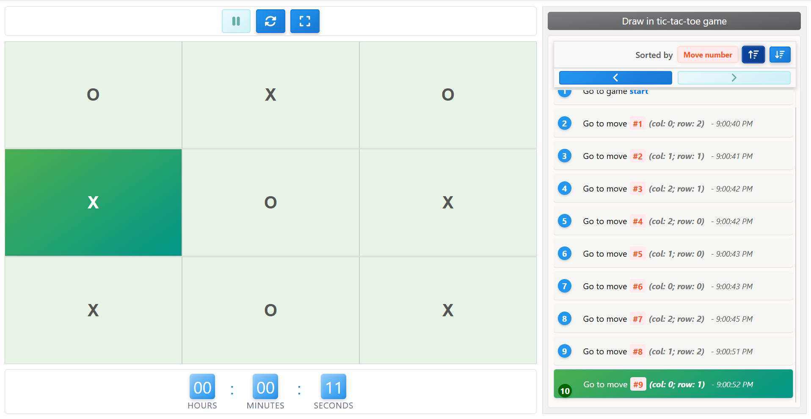
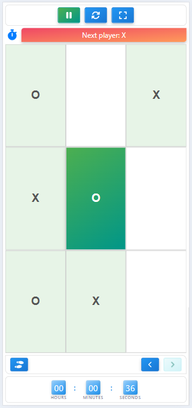
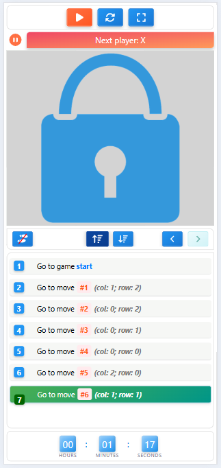
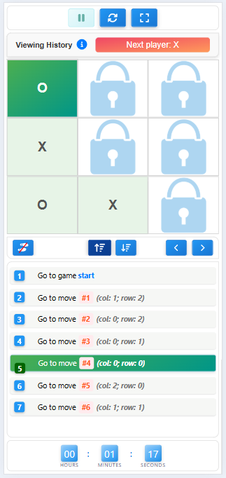
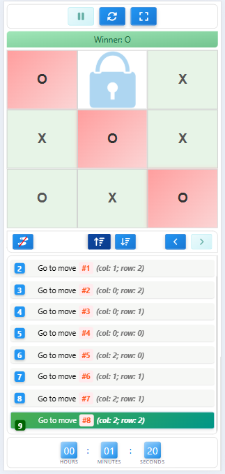
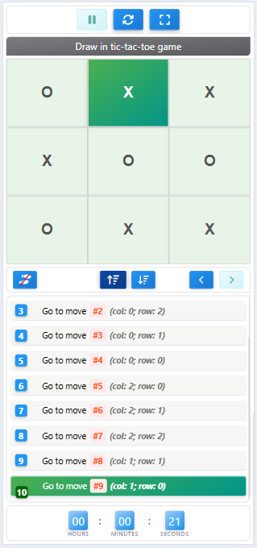

# Tic-Tac-Toe on React
Simple Tic-Tac-Toe game built with [React, TypeScript, and Redux].

## [Live demo](https://matsola-sv.github.io/tictactoe-rxn/)

### Desktop version











### Mobile version












## Run Locally
### 1. Install Dependencies
```sh
$ npm install
```

### 2. Run development server
```sh 
$ npm start
```
Runs the app in the development mode.\
Open [http://localhost:3000](http://localhost:3000) to view it in the browser.

---

## Run tests
```sh
$ npm test
```

Launches the test runner in the interactive watch mode.\
See the section about [running tests](https://facebook.github.io/create-react-app/docs/running-tests) for more information.

## Build the project
```sh
$ npm run build
```
Builds the app for production to the `build` folder.\
It correctly bundles React in production mode and optimizes the build for the best performance.

## Limitations

* The fullscreen toggle button is not displayed if the browser does not support this functionality. For example, this feature does not work on iPhones or other devices that do not support fullscreen mode.

## Future Features

* Game save functionality with the ability to load the most recent save or select from a list.
* Implementation of a bot for the game.
* Socket-based multiplayer support: each player can play in their own window, or if a server is implemented, two players can play online.